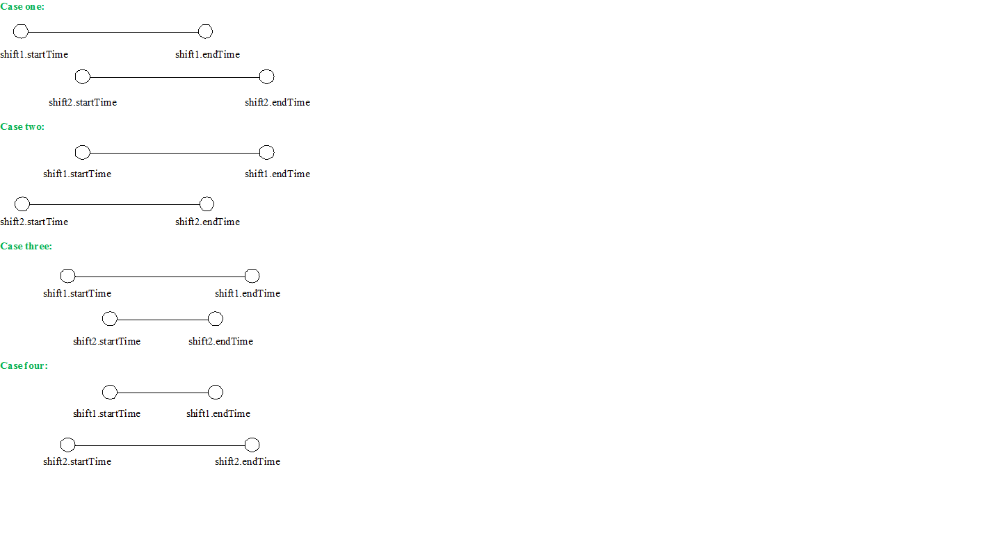
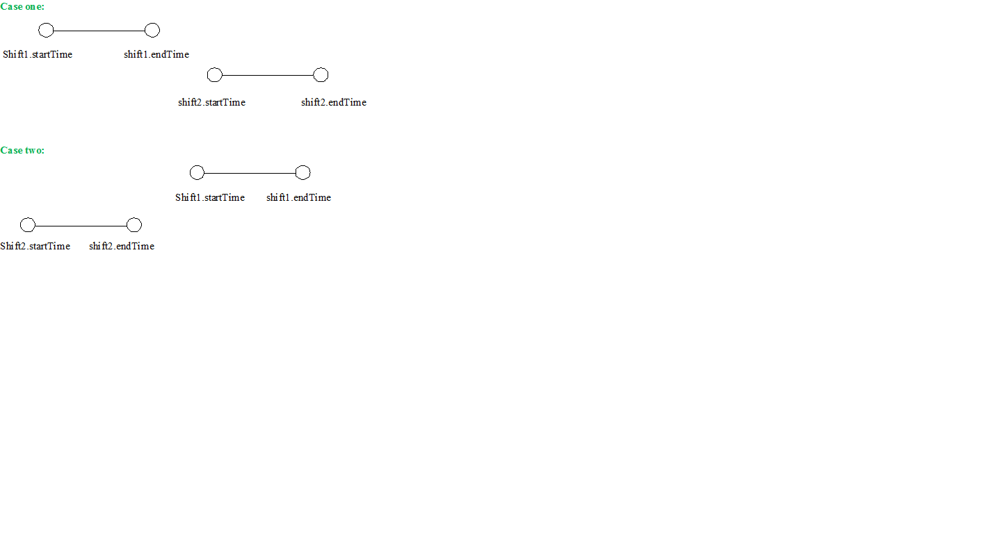

# Shift Overlapping
Determining if Two shifts Overlap or not by comparing two Date Ranges 

## There are four possible cases of overlapping for two dates:

## And there are two cases of not overlapping:

The following line represents not overlapping case:

### shift1.endTime <= shift2.startTime || shift1.startTime >= shift2.endTime

isOverlapping function returns the opposite.

The following example validates the entered dates first to check that:
* shift1.startTime < shift1.endTime AND
* shift2.startTime < shift2.endTime

before executing isOverlapping function.

Here is an <a href="https://lubana85.github.io/Shift-Overlapping/"> Example </a> with ovelapped dates.

